<!-- 
**Car-Toso/Car-Toso** is a ✨ _special_ ✨ repository because its `README.md` (this file) appears on your GitHub profile.
--> 
# 📊 **Data Analytics Portfolio** 📊

## **About me**🧠

Data & Business Intelligence Analyst specialized in SQL, Power BI, and KPI-driven reporting. I design and maintain end-to-end BI solutions focused on transforming complex datasets into actionable insights for decision-making.

I am a Data Analyst with 10+ years of experience in organizing technical processes and industrial systems. My background in Mechanical Engineering and FEA simulations allows me to apply high-level analytical precision to data architecture, ensuring accuracy and scalability in every dashboard and model I build.

You can view my [CV here](https://github.com/Car-Toso/Car-Toso/tree/main/CV) and my [LinkedIn here](https://www.linkedin.com/in/carlos-ruben-tosoratto-90a428111/).

## **Projects Showcase**🚀
1. [End-to-End E-Commerce Analytics Platform (SQL + Power BI)](#project-n1-end-to-end-e-commerce-analytics-platform)
2. [End-to-End-Database-Engineering (SQL + PowerBI)](#project-n2-end-to-end-engineering-project-manager-db)
3. [Sales Performance Analytics Dashboard (Power BI)](#project-n3-sales-performance-analytics-dashboard)
4. [Customer Behavior and Engagement Analytics (Big Query + Tableau)](#project-n4-customer-behavior-and-engagement-analytics)

***
***

  

### **Project N°1: End-to-End E-Commerce Analytics Platform**

Data analysis and visualization project of Olist E-commerce, featuring an interactive Power BI dashboard and SQL queries for data extraction. Full documentation and source code are available in the [project repository](https://github.com/Car-Toso/Olist-ECommerce-SQL-PBI).

> #### 📊 Project Highlights
> * **🎯Business Goal:** Transformed raw transactional data into a comprehensive E-commerce Analytics platform to drive revenue growth, optimize logistics, and identify high-value customer segments.
> * **📈Key Metrics:** Engineered **+25 advanced DAX measures** (YoY/MoM Growth, Profit Margins, & Shipping Efficiency) and implemented a robust **Star Schema** data model for optimized performance.
> * **📂Data Size:** Processed and integrated **9 relational tables** using complex SQL transformations and multi-stage data cleansing.
> * **🛠️ Tech Stack:** **PostgreSQL** (ETL & Data Wrangling), **Power BI** (Data Modeling & UI/UX Design), **Power Query**.
> * **💡 Main Result:** Delivered a decision-making tool that identifies underperforming product categories and regional shipping bottlenecks in real-time, enabling data-driven inventory adjustments.

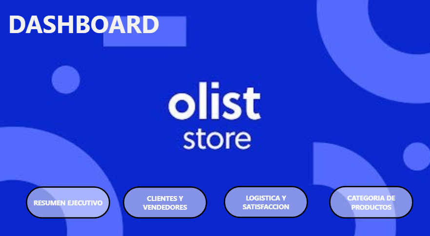

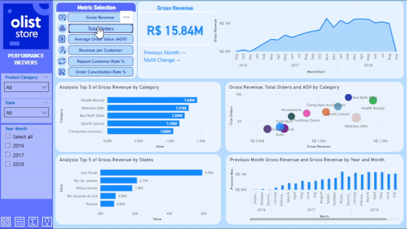

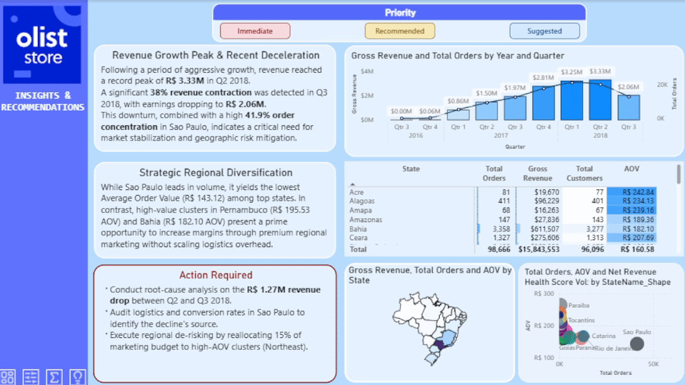

#### **Index E-Commerce Analytics Platform**

1. [**Overview**📘](#1-overview)
2. [**Data & Preparation**📂](#2-data--preparation)
3. [**Feature Creation & Analysis**⚙️](#3-feature-creation--analysis)
4. [**Visualizations & Key insights**📈](#4-visualizations--key-insights)
5. [**Recommendations Based on Key Findings**💡](#5-recommendations-based-on-key-findings)

#### **1. Overview**

This project provides a comprehensive 360° analysis of **Olist**, the largest department **store marketplace in Brazil**. By transforming raw transactional data into a four-stage analytical ecosystem, this dashboard enables executive-level decision-making focused on revenue health, regional performance, and strategic growth. The analysis identifies key drivers of success and critical areas for risk mitigation.

#### **2. Data & Preparation**

Building a scalable foundation using a robust ETL pipeline and optimized modeling.

#### **SQL-Driven ETL**

 Processed raw transactional data in PostgreSQL through a multi-stage [pipeline](https://github.com/Car-Toso/End-to-End-E-Commerce-Analytics-Platform-SQL-Power-Bi/tree/main/Sql):

  * **Database Design:** Defined the schema and relational integrity constraints ([01_schema](https://github.com/Car-Toso/End-to-End-E-Commerce-Analytics-Platform-SQL-Power-Bi/blob/main/Sql/01_schema.sql), [03_constraints](https://github.com/Car-Toso/End-to-End-E-Commerce-Analytics-Platform-SQL-Power-Bi/blob/main/Sql/03_constraints_fix.sql)).

  * **Data Wrangling:** Handled large-scale ingestion and performed deep EDA to identify market trends ([02_load](https://github.com/Car-Toso/End-to-End-E-Commerce-Analytics-Platform-SQL-Power-Bi/blob/main/Sql/02_load_raw.sql) [4_eda](https://github.com/Car-Toso/End-to-End-E-Commerce-Analytics-Platform-SQL-Power-Bi/blob/main/Sql/04_eda.sql).

  * **Optimization Layer:** Developed **SQL Views** ([5_normalization](https://github.com/Car-Toso/End-to-End-E-Commerce-Analytics-Platform-SQL-Power-Bi/blob/main/Sql/05_normalization_views.sql)) to encapsulate business logic, creating a "Single Source of Truth" for Power BI.

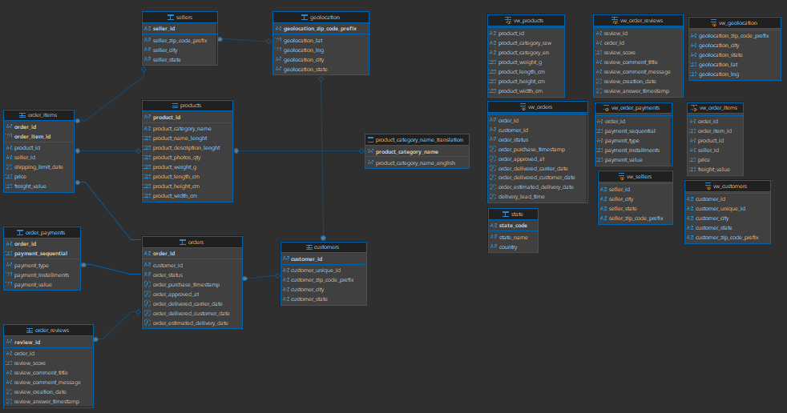

#### **Data Modeling (Star Schema)**

Designed a high-performance architecture centered on *fact_orders* and *fact_payments*.

* Dual-Calendar System: Implemented a standard Calendar and a Disconnected Calendar for dynamic time-window switching (1W, 1M, YTD).

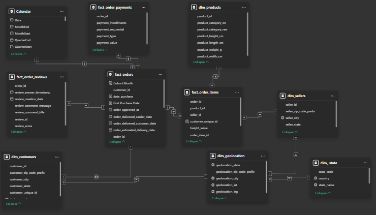

#### **3. Feature Creation & Analysis**

This section highlights the technical complexity required to transform data into strategic tools.

* **Yearly Health Index (Composite KPI):**
  * Developed a custom **weighted algorithm (0-1)** that integrates Revenue, On-Time Delivery, and Customer Satisfaction into a single "Business Pulse" metric.

* **Dynamic UX Framework:**

  * Metric Switcher: A single interface to toggle between 6 different KPIs using SWITCH logic and interactive bookmarks.
  * Custom Time Windows: Implementation of a Disconnected Calendar to allow 1W, 1M, and YTD "zooming" without affecting global filters.
  * Volatility Smoothing: Flexible Moving Averages (3 to 30 days) using AVERAGEX to identify real trends behind daily noise.

#### **4. Visualizations & Key insights**

Key discoveries extracted from the 4-stage dashboard ecosystem:

* **Growth Plateau:** Customer acquisition stalled at **~20K/quarter** in 2018. With near-zero retention, the business reached a saturation risk.

* **Revenue Integrity:** High operational efficiency with a **97% retention rate**; only 3% leakage from cancellations.

* **Operational Friction:** High volume of **1-star** reviews despite a 4.09 average, indicating localized but severe service failures.

* **Logistics Opportunity:** "Promised vs. Actual" delivery analysis shows an excessive safety buffer. Tightening estimates could significantly **boost conversion rates**.

#### **5. Recommendations Based on Key Findings**

**Strategic roadmap** based on data evidence:

1- **Retention First:** Launch a loyalty program to break the 2018 acquisition plateau.

2- **Friction Audit:** Investigate the R$ 1.27M revenue drop in late 2018 by cross-referencing 1-star reviews with specific sellers.

3- **Market Expansion:** Shift 15% of the budget from saturated Sao Paulo to **high-AOV clusters in the Northeast** (Bahia/Pernambuco) to improve margins.

***
***
### **Project N°2: End-to-End Engineering Project Manager DB**

This is a summary of the project. Full details and the complete code are available in the [project repository](https://github.com/Car-Toso/CS50-SQL-Project-Engineering-DB/tree/main).

If you want to see the final project presentation, click this link [Final Project Presentation](https://youtu.be/bjtHTrzuTDg) 

  

>#### 📊 Project Highlights
> * **📈 Key Metrics:** Implemented 7 interconnected entities with optimized indexing, 4 SQL views for automated reporting, and 3 specialized Power BI dashboards.
> * **📂 Data Integrity:** Developed SQL Triggers for "Soft Delete" logic and enforced strict referential integrity through Primary/Foreign Key constraints.
> * **🛠️ Tech Stack:** SQLite (Schema Design & Triggers), DB Browser, Power BI (Relational Modeling & Visualization).
> * **💡 Main Result:** Developed a scalable "Database-to-Dashboard" pipeline that enables real-time monitoring of project acceptance rates, staff workload, and equipment ROI.

#### Index Engineering Project Manager DB (SQL + Power BI)

1. [**Overview📘**](#1-overview-1)
2. [**Scope**🎯](#2-scope)
3. [**Key Features**🧩](#3-key-features)
4. [**Database Design & Preparation**📂](#4-database-design--preparation)
5. [**Highlights**💡](#5-highlights)
6. [**Future Improvements**🚀](#6-future-improvements)

#### **1. Overview**

Designed and implemented a relational database system for an engineering consultancy firm to manage staff, clients, projects, budgets, and equipment assignments. The system enables efficient data organization, supports analytical queries, and has been integrated with Power BI for dynamic visualization of business metrics through interactive dashboards.

#### **2. Scope**

Building a reliable, high-performance foundation.

* **Relational Modeling:** Developed a normalized [schema](https://github.com/Car-Toso/End-to-End-Database-Engineering-SQL-Power-BI/blob/main/Sql/schema.sql) featuring 7 core entities with many-to-many relationships for staff and equipment allocation.

* **Data Integrity & Logic:** Implemented [SQL Triggers](https://github.com/Car-Toso/End-to-End-Database-Engineering-SQL-Power-BI/blob/main/Sql/schema.sql#L96) to prevent data loss via "Soft Delete" mechanisms. Enforced Referential Integrity and optimal data typing for precise financial tracking in budgets.

* **Optimization Layer:** Created custom [SQL Views](https://github.com/Car-Toso/End-to-End-Database-Engineering-SQL-Power-BI/blob/main/Sql/schema.sql#L146) to simplify complex joins, serving as an optimized data layer for reporting.

* **BI Integration:** Connected SQLite database to Power BI for real-time [data reporting](https://github.com/Car-Toso/End-to-End-Database-Engineering-SQL-Power-BI/blob/main/Engineering%20Office.pbix).

#### **3. Key Features**

The analytical layer consists of three strategic dashboards:

* **Executive Overview:** Real-time KPI tracking for project health and global performance.

* **Commercial Analytics:** Deep dive into budget acceptance rates and client-specific revenue distribution.

* **Operational Efficiency:** Granular monitoring of staff workload and equipment ROI to prevent bottlenecks.

#### **4. Database Design & Preparation**

* **Referential Integrity:** Strategic implementation of Primary and Foreign Keys across 7 interconnected tables to ensure data consistency.

* **Data Typing:** Precise application of INTEGER, TEXT, DATE, and BOOLEAN types to optimize storage and financial accuracy in budgets.

* **Business Logic:** Developed SQL Triggers to enforce "Soft Delete" policies and maintain audit trails without losing historical records.

* **BI Optimization:** Refined the relational schema to minimize complexity during Power BI integration, ensuring high-performance DAX calculations.

#### **5. Highlights**

* **Full Pipeline:** Successful implementation of a complete "Database-to-Dashboard" workflow, from raw SQL modeling to interactive visualization.

* **CS50 Methodology:** Project built following advanced SQL design principles, including normalization (3NF) and indexing, as taught in **CS50 SQL**.

* **Analytical Bridge:** Demonstrates the ability to bridge engineering operations with business intelligence, turning raw records into actionable KPIs.

* **Scalable Foundation:** Provides a production-ready architecture capable of supporting data-driven decision-making in consultancy environments.

#### **6. Future Improvements**

* Add task-level management and scheduling.

* Include equipment maintenance and cost tracking.

* Implement user access control and advanced reporting layers.

  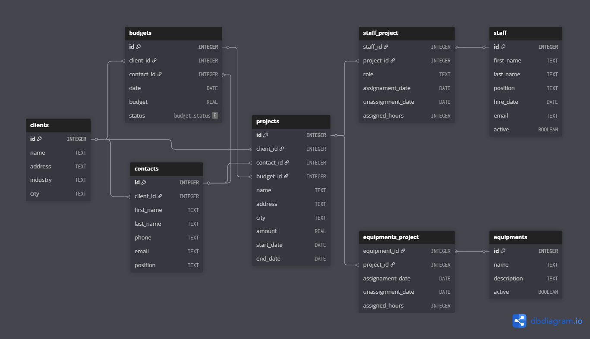
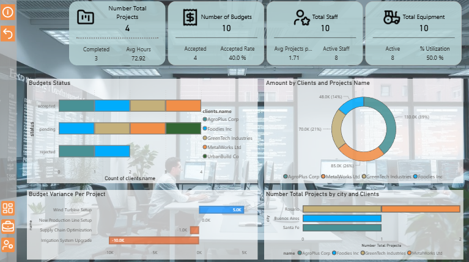
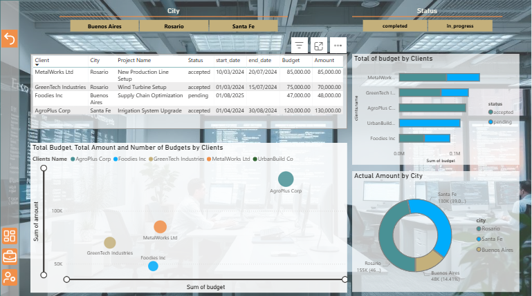
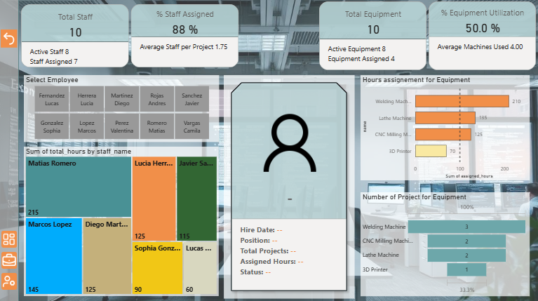
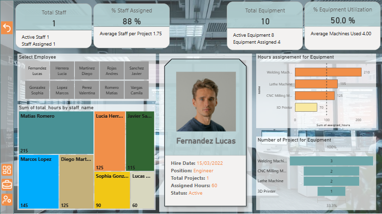

***
***

  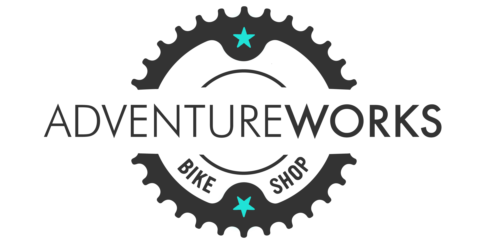

### **Project N°3: Sales Performance Analytics Dashboard**

Interactive Power BI dashboard analyzing Adventure Works sales, products and customers, developed using advanced DAX and Power Query techniques.
Full documentation and source code are available in the [project repository](https://github.com/Car-Toso/Adventure-Works-Sales-Dashboard).

> #### 📊 Project Highlights
> * **🎯Business Goal:** To provide Adventure Works' management with an interactive dashboard to monitor KPIs like sales, profit, and returns, enabling data-driven decisions across products and regions.
> * **📈Key Metrics:** Developed DAX measures for Total Sales ($24.9M), Profit ($10M), and a low Return Rate (2.17%). Implemented time-intelligence functions for period-over-period performance tracking.
> * **📂Data Source:** Integrated and transformed multiple CSV files containing transaction, customer, and product data using Power Query.
> * **🛠️ Tech Stack:** **Power BI** (Data Modeling & UI/UX Design), **Power Query** (ETL), **DAX** (Advanced Measures).
> * **💡 Main Result:** The dashboard successfully identified "Tires and Tubes" as a key sales driver and North America/Australia as top markets, leading to recommendations for targeted marketing and customer retention strategies.

  

#### Index Sales Performance Analytics Dashboard
1. [**Overview**📘](#1-overview-2)
2. [**Data & Preparation**📂](#2-data--preparation-1)
3. [**Feature Creation & Analysis**⚙️](#3-feature-creation--analysis-1)
4. [**Visualizations & Key insights**📈](#4-visualizations--key-insights-1)
5. [**Recommendations Based on Key Findings**💡](#5-recommendations-based-on-key-findings-1)

#### **1. Overview**

This project focuses on the fictional company AdventureWorks (a global cycling equipment manufacturer), simulating a real-world business intelligence scenario: transforming raw data into actionable insights for management. The goal is to monitor and analyze key KPIs such as sales, revenue, profit, and returns, comparing performance across regions, products, and key customers through an interactive Power BI dashboard.
This project presents a sales performance analysis for **Adventure Works**, developed during the *Power BI Desktop for Business Intelligence* course by Maven Academy.

#### **2. Data & Preparation**

The dataset consists of CSV files including transactions, returns, products, customers, and sales territories.
You can find the dataset at the following link:  
[AdventureWorks Sales Dataset](https://www.kaggle.com/datasets/ukveteran/adventure-works)

Data preparation steps included:

- Standardizing column names and correcting capitalization for uniformity.
- Splitting or merging columns to create more granular calculated fields.
- Importing all tables into Power BI’s relational model, ensuring clean, structured, and analysis-ready data.
Additional cleaning and transformation:
- Handling missing or blank values, removing duplicates, and correcting date, number, and text formats.
- Merging related datasets (e.g., sales + returns) and adding calculated columns for segmentation and deeper analysis.

#### **3. Feature Creation & Analysis**

Once the data was clean, relationships between tables were defined in Power BI.
Key calculations and features:

- DAX measures for core KPIs: Total Sales, Total Orders, Profit, Return Rate.
- Profit margin as (Profit / Sales) to evaluate performance by product/region.
- Period-over-period comparisons using CALCULATE() and DATEADD() to track recent growth (e.g., 10, 90 days).

Segmentation and analysis:

- Customer segmentation by year and continent to study trends over time.
- Regional aggregations to compare sales, profit, and growth across markets.
- Product classification by category and tier according to revenue and margin to highlight top and low performers.
- Dynamic “What‑if” parameters to simulate price adjustments and estimate potential impact on profitability.

#### **4. Visualizations & Key Insights**

Multiple dashboards were developed, each with a specific focus:
- Sales Overview: global KPI summary (Total Sales, Profit, Return Rate) with period and region filters.
- Regional Analysis: performance by continent and country, highlighting top markets and growth opportunities.
- Customer Insights: customer segmentation by year and continent, spend distribution, and behavior patterns.
- Product Performance: evaluation of product categories by revenue and profit margin to identify top and lagging products.

Key findings:
- Revenue of ~US $24.9 M with profit of ~US $10 M across ~25,000 orders; return rate of 2.17%, indicating reasonable operational efficiency.
- The Accessories category had the highest order volume (~17,000), driven by Water Bottles, the top-selling product.
- Tires and Tubes showed the strongest demand, making them key products in the sales mix.
- Regionally, the US leads sales, followed by Australia, suggesting strong penetration in North America and Oceania.
- A high-value customer, Maurice Shan, placed 6 orders totaling US $12.4 K, showing the impact of top clients.

#### **5. Recommendations Based on Key Findings**

- Focus on top-performing regions (US, Australia) to strengthen marketing and distribution strategies.
- Expand the Accessories category, particularly Water Bottles, to capitalize on high demand.
- Explore bundling or cross-selling strong products like Tires and Tubes to leverage key revenue drivers.
- Implement retention strategies for high-value customers (like Maurice Shan) to increase long-term revenue.

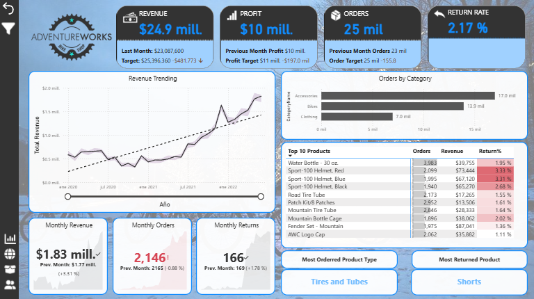
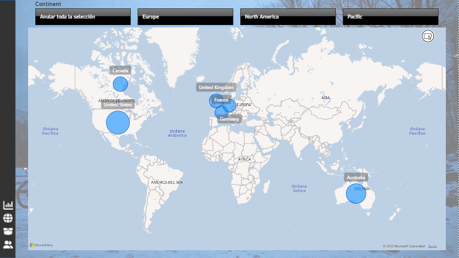
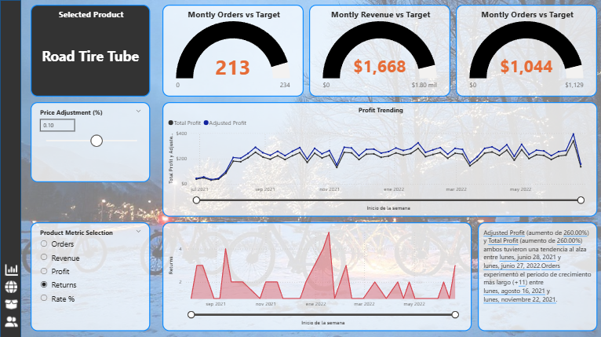
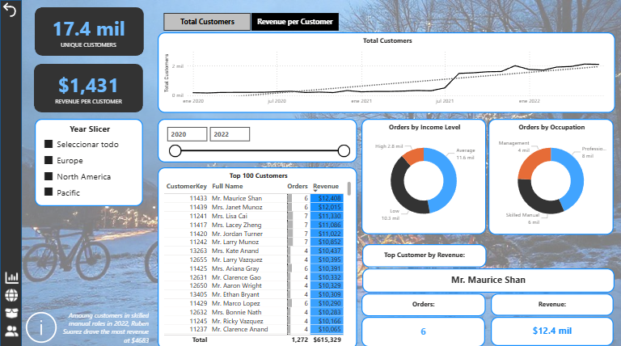

***
***

  

### **Project N°4: Customer Behavior and Engagement Analytics**

For more details about this project, please visit the [project repository](https://github.com/Car-Toso/Bellabeat-Customer-Behavior-Analysis.git).

> #### 📊 Project Highlights
> * **🎯Business Goal:** To analyze smart device data for Bellabeat to uncover trends in user activity and sleep, guiding marketing strategy and improving product engagement.
> * **📈Key Metrics:** Analyzed daily steps, sleep duration, and sedentary vs. active minutes. Segmented users by activity level and device usage frequency to identify behavioral patterns.
> * **📂Data Source:** Utilized a public Kaggle dataset of 30 Fitbit users, containing daily activity, sleep, and weight logs.
> * **🛠️ Tech Stack:** **BigQuery** (SQL for Data Cleaning & Analysis), **Tableau** (Dashboarding & Visualization).
> * **💡 Main Result:** Revealed that while 93% of users were highly engaged with their device, 32% of their activity was sedentary and sleep was below recommended levels. This led to recommendations for personalized in-app challenges and sleep hygiene reminders.

  

#### Index Customer Behavior and Engagement Analytics
1. [**Overview**📘](#1-overview-3)
2. [**Data & Preparation**📂](#2-data--preparation-2)
3. [**Feature Creation & Analysis**⚙️](#3-feature-creation--analysis-2)
4. [**Visualizations & Key insights**📈](#4-visualizations--key-insights-2)
5. [**Recommendations Based on Key Findings**💡](#5-recommendations-based-on-key-findings-2)

#### **1. Overview**

This project analyzes user activity and sleep patterns from Bellabeat smart devices, aiming to extract actionable insights for wellness improvement. The analysis was performed using **BigQuery** and **Tableau**, following a structured end-to-end process.

***
#### **2. Data & Preparation**
- Imported daily activity, sleep day, and weight log info datasets.
- Handled blank cells, formatted columns, and ensured consistency.
- Created views to organize data, remove duplicates, and round numeric values.
- Merged activity and sleep datasets for a comprehensive analysis.

***
#### **3. Feature Creation & Analysis**
- Categorized activity levels based on active minutes.
- Calculated average steps per user, identifying those exceeding 8000 and 10000 daily steps.
- Measured sedentary time and sleep duration to identify areas for improvement.
- Analyzed device usage patterns across participants.

***
#### **4. Visualizations & Key insights**

1. **Activity Category – Vertical bar chart:** *32% of records are sedentary*, showing predominantly low-intensity activity.
2. **App Usage – Donut Chart:** *93.5% of users are highly active within the app*, indicating strong engagement.
3. **Average Total Steps & Average Total Minutes of Sleep – Grouped Bar Chart by Day of the Week:** *Only 2 days* exceed 8,000 steps; none reach 10,000. Average sleep is below 8 hours daily, revealing insufficient rest.
4. **Average Total Steps vs. Time in Bed – Combined Bar & Line Chart:** Higher step counts correlate with longer time in bed, suggesting users recover more after active days.
5. **Average Total Steps per User – Bar Chart:** Out of 33 users, *7 exceed 10,000 steps* and *14 exceed 8,000 steps*, showing that *less than half of users reach the level suggested by research for health benefits*.
This highlights that while some users are highly active, *most are below the recommended daily activity thresholds*, indicating potential opportunities for engagement or personalized activity goals.
6. **Lightly, Fairly, and Very Active Minutes vs. Weekday – Grouped Bar Chart:** Lightly active minutes peak on Fridays and Saturdays, reflecting increased weekend activity that could inform targeted wellness recommendations.

***
#### **5. Recommendations Based on Key Findings**

1. **Increase Data Sample Size:** 📊 Increase the number of users and tracking duration to improve reliability and reveal deeper patterns.
2. **Encourage Daily Activity:** 🚶‍♂️🏃‍♀️ Use personalized reminders or gamified challenges to reduce sedentary behavior and help more users reach step goals.
3. **Promote Consistent Sleep:** 😴🛌 Offer guidance and reminders to promote consistent, adequate rest.
4. **Leverage Positive Activity Patterns:** 🎉📈 Encourage weekend activity and balance it with recovery insights.
5. **Personalized Engagement Opportunities:** 🧩💡 Segment users by activity level to deliver targeted wellness recommendations
     
***

  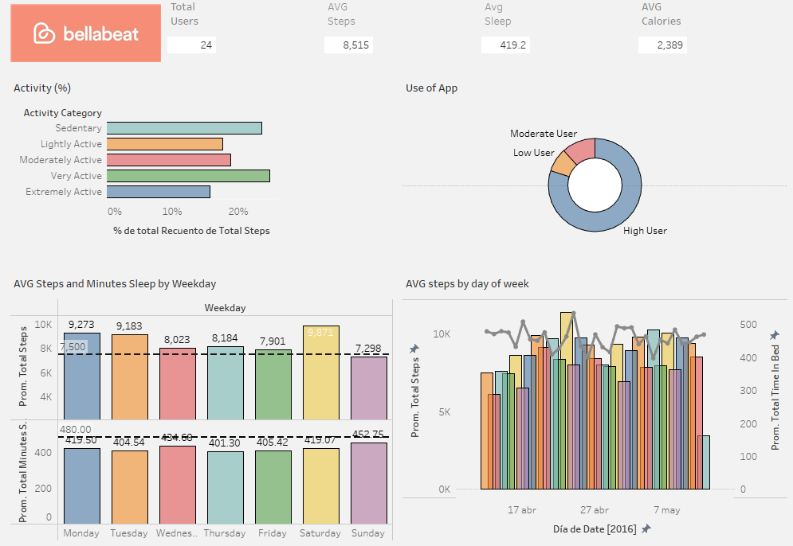
  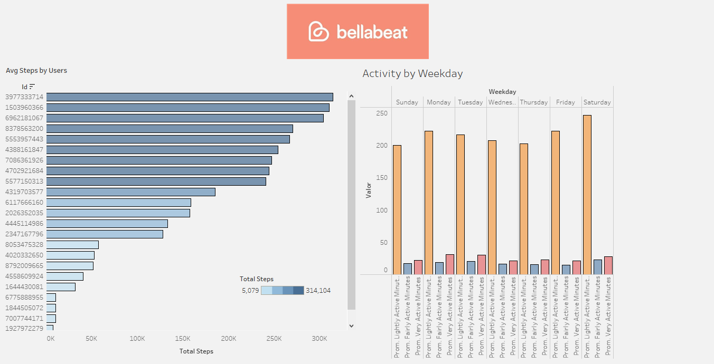

***
***
