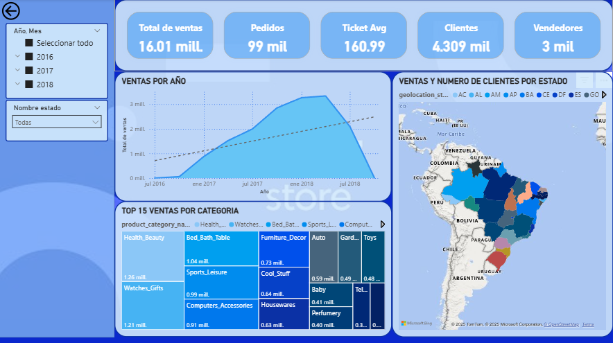
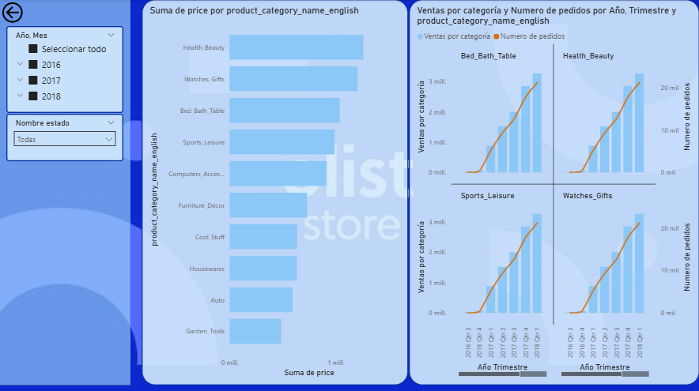

<!-- 
**Car-Toso/Car-Toso** is a ✨ _special_ ✨ repository because its `README.md` (this file) appears on your GitHub profile.
--> 
# 📊 **Data Analytics Portfolio** 📊

## **About me**🧠

Data & Business Intelligence Analyst specialized in SQL, Power BI, and KPI-driven reporting. I design and maintain end-to-end BI solutions focused on transforming complex datasets into actionable insights for decision-making.

I am a Data Analyst with 10+ years of experience in organizing technical processes and industrial systems. My background in Mechanical Engineering and FEA simulations allows me to apply high-level analytical precision to data architecture, ensuring accuracy and scalability in every dashboard and model I build.

You can view my [CV here](https://github.com/Car-Toso/Car-Toso/tree/main/CV) and my [LinkedIn here](https://www.linkedin.com/in/carlos-ruben-tosoratto-90a428111/).

## **Projects Showcase**🚀
1. [End-to-End E-Commerce Analytics Platform (SQL + Power BI)](#project-n1-end-to-end-e-commerce-analytics-platform)
2. [End-to-End-Database-Engineering (SQL + PowerBI)](#project-n2-end-to-end-engineering-project-manager-db)
3. [Sales Performance Analytics Dashboard (Power BI)](#project-n3-sales-performance-analytics-dashboard)
4. [Customer Behavior and Engagement Analytics (Big Query + Tableau)](#project-n4-customer-behavior-and-engagement-analytics)
5. [Electronics Retail Sales Analytics Dashboard (Power BI)](#project-n5-electronics-retail-sales-analytics-dashboard)
6. [Store-Level Sales and Margin Performance Analytics (Power BI)](#project-n6-store-level-sales-and-margin-performance-analytics)

***
***

  

### **Project N°1: End-to-End E-Commerce Analytics Platform**

This is a summary of the project. Full details and the complete code are available in the [project repository](https://github.com/Car-Toso/Olist-ECommerce-SQL-PBI).

#### Index E-Commerce Analytics Platform

1. [**Overview**📘](#1-overview)
2. [**Data & Preparation**📂](#2-data--preparation)
3. [**Feature Creation & Analysis**⚙️](#3-feature-creation--analysis)
4. [**Visualizations & Key insights**📈](#4-visualizations--key-insights)
5. [**Recommendations Based on Key Findings**💡](#5-recommendations-based-on-key-findings)

#### **1. Overview**

This project provides a comprehensive 360° analysis of **Olist**, the largest department **store marketplace in Brazil**. By transforming raw transactional data into a four-stage analytical ecosystem, this dashboard enables executive-level decision-making focused on revenue health, regional performance, and strategic growth. The analysis identifies key drivers of success and critical areas for risk mitigation.

#### **2. Data & Preparation**

The project follows a robust end-to-end data engineering pipeline to ensure data integrity and optimal performance in **Power BI**. The raw dataset from Olist was processed using **PostgreSQL**, moving from unstructured raw files to a refined Star Schema.

#### *Database Engineering & ETL Flow*
To maintain a scalable and clean environment, the following SQL-based workflow was executed:

* **Schema Definition (01_schema)**: Created a structured environment in PostgreSQL to host transactional data, ensuring correct data types for financial accuracy.
* **Raw Data Ingestion (02_load_raw)**: Successfully migrated CSV files into the database, handling encoding and large-scale ingestion.
* **Integrity Enforcement (03_constraints_fix)**: Defined Primary and Foreign Keys to establish relational integrity and prevent data duplication.
* **Exploratory Data Analysis (04_eda)**: Conducted deep SQL exploration to identify outliers, missing values, and seasonal trends within the Brazilian e-commerce landscape.
* **Normalization & Business Views (05_normalization_views)**: Instead of loading raw tables, I developed optimized **SQL Views**. This layer encapsulates business logic, pre-aggregates financial metrics, and serves as a "Single Source of Truth" for Power BI.

#### *Data Modeling*
The final data architecture was implemented as a **Star Schema** in Power BI to maximize DAX efficiency:

* Fact Tables: Centered around fact_orders and fact_order_payments to track every financial transaction.
* Dimension Tables: Developed comprehensive dimensions for dim_products, dim_customers, dim_sellers, and dim_geography.
* Calendar Architecture: Established a dual-calendar system—a standard linked Calendar Table for core time intelligence and a Disconnected Calendar to drive the dynamic time-window switching (1W, 1M, TY, etc.) without disrupting model filters.

#### **3. Feature Creation & Analysis**

This project showcases advanced analytical capabilities by transforming raw data into actionable intelligence through complex DAX modeling and interactive UX design.

#### *Strategic Business Logic: The Yearly Health Score*

To provide an instantaneous diagnostic of business performance, I developed a weighted **Health Index (0 to 1)**. This composite metric enables stakeholders to move beyond looking at isolated KPIs by providing a holistic "Business Pulse":

* Weighted Components: The score is calculated by assigning strategic importance to different operational pillars: **Net Revenue (40%)**, **On-Time Delivery (25%)**, **Customer Volume (20%)**, and **Average Review Scores (15%)**.

* DAX Implementation: Used normalized variables to scale different units (currency, percentages, and integers) into a unified scoring system, displayed via a custom Gauge Chart for immediate visual impact.

#### *Dynamic Analysis Framework*
* Multi-Metric Selector & Interactive Bookmarks: Instead of static reports, I implemented a custom Metric Selection panel. By combining Disconnected Tables with SWITCH logic and Bookmarks, the dashboard allows users to toggle the entire visual environment between 6 different KPIs (Gross Revenue, AOV, Cancellation Rate, etc.), ensuring specific chart types are optimized for each metric without cluttering the UI.
* Custom Time Windows: To solve the limitation of standard date slicers, I developed a Time Intelligence Selector. This feature allows users to "zoom" into specific intervals: 1W, 1M, 3M, TY (This Year), LY (Last Year), and ALL. This was achieved using a disconnected calendar table to drive the minimum and maximum date boundaries within a CALCULATE filter context.
* Variable Moving Averages: To identify real growth trends amidst daily transactional noise, I created a Flexible Moving Average tool. Users can choose between 3, 7, 14, or 30-day windows, utilizing AVERAGEX and DATESINPERIOD to smooth volatility based on the required level of granularity.

#### **4. Visualizations & Key insights**

The analytical journey is organized into four specialized dashboards, moving from high-level summaries to granular, actionable recommendations.

#### *Dashboard 1 & 2: Performance & Drivers*
* Executive Overview: A comprehensive 360° view of the business, highlighting a Gross Revenue of R$ 15.84M and an On-Time Delivery (OTD) rate of 91.9%.
* Performance Drivers: Utilizes interactive bookmarks to isolate top-performing categories (like Health & Beauty and Watches) and regional powerhouses like Sao Paulo.

#### *Dashboard 3: Diagnostic Insights (Advanced DAX)*
This section utilizes the "Health Score" logic to identify specific business risks:

* **Revenue Integrity (Funnel Analysis)**: The ecosystem demonstrates high operational efficiency with a **97% revenue retention rate**. Leakage from cancellations (R$ 0.11M) and pipeline losses (R$ 0.32M) remains below 3%, suggesting highly effective order fulfillment.
* **Customer Acquisition & Retention**: A "Growth Stagnation Alert" was identified in 2018 as customer acquisition plateaued at **~20K per quarter**. With near-zero retention, new acquisitions only offset churn, leading to a market saturation risk.
* **Operational Polarization**: Despite a strong 4.09 average review score, a high volume of **1-star reviews** reveals significant operational friction that threatens brand reputation.
* **Logistics Efficiency**: The analysis of "Promised vs. Actual" delivery dates shows a massive safety buffer. Tightening these estimates presents a **Competitive Edge Opportunity** to increase sales conversion without risking reliability.

#### **5. Recommendations Based on Key Findings**

To ensure long-term sustainability and margin expansion, the following strategic actions are recommended:

**Immediate (High Priority): Risk Mitigation**
* **Root-Cause Audit**: Conduct an immediate investigation into the R$ 1.27M revenue drop observed between Q2 and Q3 2018.
* **Friction Reduction**: Address the source of 1-star reviews to halt the customer decline observed in the latter half of 2018.

**Recommended: Growth & Retention**
* **Loyalty Program Implementation**: Shift focus from pure acquisition to customer retention. Developing a repeat-buyer incentive is critical to break the "plateau" observed in the 2018 customer base.
* **Logistics Optimization**: Tighten delivery date estimates. Reducing the "promised buffer" will improve the customer experience and competitive positioning against faster shippers.

**Suggested: Geographic Expansion**
* **Regional De-risking**: Reallocate 15% of the marketing budget from the saturated Sao Paulo market to **high-AOV clusters in the Northeast (Pernambuco/Bahia)**. This will increase overall margins without scaling logistics overhead.

***
***
### **Project N°2: End-to-End Engineering Project Manager DB**

This is a summary of the project. Full details and the complete code are available in the [project repository](https://github.com/Car-Toso/CS50-SQL-Project-Engineering-DB/tree/main).

If you want to see the final project presentation, click this link [Final Project Presentation](https://youtu.be/bjtHTrzuTDg) 

  

#### Index Engineering Project Manager DB (SQL + Power BI)

1. [**Overview📘**](#1-overview-1)
2. [**Scope**🎯](#2-scope)
3. [**Key Features**🧩](#3-key-features)
4. [**Database Design & Preparation**📂](#4-database-design--preparation)
5. [**Highlights**💡](#5-highlights)
6. [**Future Improvements**🚀](#6-future-improvements)

#### **1. Overview**

Designed and implemented a relational database system for an engineering consultancy firm to manage staff, clients, projects, budgets, and equipment assignments. The system enables efficient data organization, supports analytical queries, and has been integrated with Power BI for dynamic visualization of business metrics through interactive dashboards.

#### **2. Scope**

- Modeled key entities: Staff, Clients, Contacts, Projects, Budgets, Equipments, and their relationships.
- Implemented soft delete for staff records to preserve data integrity.
- Supported full CRUD operations and structured queries for management insights.
- Connected SQLite database to Power BI for real-time data analysis and reporting.

#### **3. Key Features**

- Manage clients, budgets, and projects with status tracking (pending, accepted, rejected).
- Assign staff and equipment to projects through many-to-many relationships.
- Create SQL views for summarized reporting (e.g., project overviews, workload analysis).
- Added indexes on frequently joined columns for better performance.
- Develop 3 interactive Power BI dashboards:
  - Overview Dashboard: Summarizes key KPIs for projects, budgets, equipment, and staff to provide a clear snapshot of overall performance.
  - Clients & Budgets Dashboard: Tracks total budgets, acceptance rates, and project distribution by client.
  - Staff & Equipment Dashboard: Monitors staff workload, project involvement, and equipment utilization.

#### **4. Database Design & Preparation**

- Proper use of primary and foreign keys, ensuring referential integrity.
- Logical use of data types (INTEGER, TEXT, DATE, BOOLEAN).
- Included triggers to prevent hard deletes and maintain consistent data states.
- Optimized schema to simplify Power BI integration for visualization.

#### **5. Highlights**

- Fully functional database-to-dashboard pipeline, from data modeling in SQLite to visualization in Power BI.
- Demonstrates advanced SQL design, normalization, and trigger implementation learned through CS50 SQL.
- Integrates data analytics principles, bridging engineering operations with business intelligence.
- Provides a scalable foundation for data-driven decision-making within engineering environments.

#### **6. Future Improvements**

- Add task-level management and scheduling.
- Include equipment maintenance and cost tracking.
- Implement user access control and advanced reporting layers.

  

***
***

  

### **Project N°3: Sales Performance Analytics Dashboard**

Interactive Power BI dashboard analyzing Adventure Works sales, products and customers, developed using advanced DAX and Power Query techniques.
Full documentation and source code are available in the [project repository](https://github.com/Car-Toso/Adventure-Works-Sales-Dashboard).

  

#### Index Sales Performance Analytics Dashboard
1. [**Overview**📘](#1-overview-2)
2. [**Data & Preparation**📂](#2-data--preparation-1)
3. [**Feature Creation & Analysis**⚙️](#3-feature-creation--analysis-1)
4. [**Visualizations & Key insights**📈](#4-visualizations--key-insights-1)
5. [**Recommendations Based on Key Findings**💡](#5-recommendations-based-on-key-findings-1)

#### **1. Overview**

This project focuses on the fictional company AdventureWorks (a global cycling equipment manufacturer), simulating a real-world business intelligence scenario: transforming raw data into actionable insights for management. The goal is to monitor and analyze key KPIs such as sales, revenue, profit, and returns, comparing performance across regions, products, and key customers through an interactive Power BI dashboard.
This project presents a sales performance analysis for **Adventure Works**, developed during the *Power BI Desktop for Business Intelligence* course by Maven Academy.

#### **2. Data & Preparation**

The dataset consists of CSV files including transactions, returns, products, customers, and sales territories.
You can find the dataset at the following link:  
[AdventureWorks Sales Dataset](https://www.kaggle.com/datasets/ukveteran/adventure-works)

Data preparation steps included:

- Standardizing column names and correcting capitalization for uniformity.
- Splitting or merging columns to create more granular calculated fields.
- Importing all tables into Power BI’s relational model, ensuring clean, structured, and analysis-ready data.
Additional cleaning and transformation:
- Handling missing or blank values, removing duplicates, and correcting date, number, and text formats.
- Merging related datasets (e.g., sales + returns) and adding calculated columns for segmentation and deeper analysis.

#### **3. Feature Creation & Analysis**

Once the data was clean, relationships between tables were defined in Power BI.
Key calculations and features:

- DAX measures for core KPIs: Total Sales, Total Orders, Profit, Return Rate.
- Profit margin as (Profit / Sales) to evaluate performance by product/region.
- Period-over-period comparisons using CALCULATE() and DATEADD() to track recent growth (e.g., 10, 90 days).

Segmentation and analysis:

- Customer segmentation by year and continent to study trends over time.
- Regional aggregations to compare sales, profit, and growth across markets.
- Product classification by category and tier according to revenue and margin to highlight top and low performers.
- Dynamic “What‑if” parameters to simulate price adjustments and estimate potential impact on profitability.

#### **4. Visualizations & Key Insights**

Multiple dashboards were developed, each with a specific focus:
- Sales Overview: global KPI summary (Total Sales, Profit, Return Rate) with period and region filters.
- Regional Analysis: performance by continent and country, highlighting top markets and growth opportunities.
- Customer Insights: customer segmentation by year and continent, spend distribution, and behavior patterns.
- Product Performance: evaluation of product categories by revenue and profit margin to identify top and lagging products.

Key findings:
- Revenue of ~US $24.9 M with profit of ~US $10 M across ~25,000 orders; return rate of 2.17%, indicating reasonable operational efficiency.
- The Accessories category had the highest order volume (~17,000), driven by Water Bottles, the top-selling product.
- Tires and Tubes showed the strongest demand, making them key products in the sales mix.
- Regionally, the US leads sales, followed by Australia, suggesting strong penetration in North America and Oceania.
- A high-value customer, Maurice Shan, placed 6 orders totaling US $12.4 K, showing the impact of top clients.

#### **5. Recommendations Based on Key Findings**

- Focus on top-performing regions (US, Australia) to strengthen marketing and distribution strategies.
- Expand the Accessories category, particularly Water Bottles, to capitalize on high demand.
- Explore bundling or cross-selling strong products like Tires and Tubes to leverage key revenue drivers.
- Implement retention strategies for high-value customers (like Maurice Shan) to increase long-term revenue.

***
***

  

### **Project N°4: Customer Behavior and Engagement Analytics**

For more details about this project, please visit the [project repository](https://github.com/Car-Toso/Bellabeat-Customer-Behavior-Analysis.git).

  

#### Index Customer Behavior and Engagement Analytics
1. [**Overview**📘](#1-overview-3)
2. [**Data & Preparation**📂](#2-data--preparation-2)
3. [**Feature Creation & Analysis**⚙️](#3-feature-creation--analysis-2)
4. [**Visualizations & Key insights**📈](#4-visualizations--key-insights-2)
5. [**Recommendations Based on Key Findings**💡](#5-recommendations-based-on-key-findings-2)

#### **1. Overview**

This project analyzes user activity and sleep patterns from Bellabeat smart devices, aiming to extract actionable insights for wellness improvement. The analysis was performed using **BigQuery** and **Tableau**, following a structured end-to-end process.

***
#### **2. Data & Preparation**
- Imported daily activity, sleep day, and weight log info datasets.
- Handled blank cells, formatted columns, and ensured consistency.
- Created views to organize data, remove duplicates, and round numeric values.
- Merged activity and sleep datasets for a comprehensive analysis.

***
#### **3. Feature Creation & Analysis**
- Categorized activity levels based on active minutes.
- Calculated average steps per user, identifying those exceeding 8000 and 10000 daily steps.
- Measured sedentary time and sleep duration to identify areas for improvement.
- Analyzed device usage patterns across participants.

***
#### **4. Visualizations & Key insights**

1. **Activity Category – Vertical bar chart:** *32% of records are sedentary*, showing predominantly low-intensity activity.
2. **App Usage – Donut Chart:** *93.5% of users are highly active within the app*, indicating strong engagement.
3. **Average Total Steps & Average Total Minutes of Sleep – Grouped Bar Chart by Day of the Week:** *Only 2 days* exceed 8,000 steps; none reach 10,000. Average sleep is below 8 hours daily, revealing insufficient rest.
4. **Average Total Steps vs. Time in Bed – Combined Bar & Line Chart:** Higher step counts correlate with longer time in bed, suggesting users recover more after active days.
5. **Average Total Steps per User – Bar Chart:** Out of 33 users, *7 exceed 10,000 steps* and *14 exceed 8,000 steps*, showing that *less than half of users reach the level suggested by research for health benefits*.
This highlights that while some users are highly active, *most are below the recommended daily activity thresholds*, indicating potential opportunities for engagement or personalized activity goals.
6. **Lightly, Fairly, and Very Active Minutes vs. Weekday – Grouped Bar Chart:** Lightly active minutes peak on Fridays and Saturdays, reflecting increased weekend activity that could inform targeted wellness recommendations.

***
#### **5. Recommendations Based on Key Findings**

1. **Increase Data Sample Size:** 📊 Increase the number of users and tracking duration to improve reliability and reveal deeper patterns.
2. **Encourage Daily Activity:** 🚶‍♂️🏃‍♀️ Use personalized reminders or gamified challenges to reduce sedentary behavior and help more users reach step goals.
3. **Promote Consistent Sleep:** 😴🛌 Offer guidance and reminders to promote consistent, adequate rest.
4. **Leverage Positive Activity Patterns:** 🎉📈 Encourage weekend activity and balance it with recovery insights.
5. **Personalized Engagement Opportunities:** 🧩💡 Segment users by activity level to deliver targeted wellness recommendations
     
***

  
  

***
***

### **Project N°5: Electronics Retail Sales Analytics Dashboard**

A summary of this project. Full details and the code will be available in the [project repository](link-al-repo) soon.

***
***

### **Project N°6: Store-Level Sales and Margin Performance Analytics**

A summary of this project. Full details and the code will be available in the [project repository](link-al-repo) soon.

