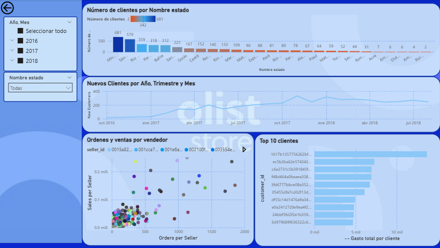

<!-- 
**Car-Toso/Car-Toso** is a ✨ _special_ ✨ repository because its `README.md` (this file) appears on your GitHub profile.
--> 
# 📊 **Data Analytics Portfolio** 📊

## **About me**🧠

Mechanical Engineer with over 10 years of experience in product design, industrial equipment development, and FEA simulations.
I bring the same analytical mindset to data analysis, using SQL, Power BI, and Tableau to drive technical and operational decisions.
Every project, in essence, is about turning data into better engineering solutions.
You can view my [CV here](https://github.com/Car-Toso/Car-Toso/tree/main/CV) and my [LinkedIn here](https://www.linkedin.com/in/carlos-ruben-tosoratto-90a428111/).

## **Projects Showcase**🚀
1. [Bellabeat - Google Data Analytics Capstone](#project-n1-bellabeat-google-data-analytics-capstone)
2. [AdventureWorks - Sales Dashboard](#project-n2-adventure-works-sales-dashboard)
3. [Engineering Project Manager DB - Harvard CS50 SQL Final Project](#project-n3-engineering-project-manager-db)
4. [Olist Brasil](#project-n4-olist-brasil)
5. [Electromas - Electronics Retail Sales](#project-n5-electromaselectronics-retail-sales)
6. [Maven Market](#project-n6-maven-market)

***
***

  

### **Project N°1: Bellabeat-Google Data Analytics Capstone**

This is a summary of this project. Full details and the code will be available in the [project repository](https://github.com/Car-Toso/Bellabeat---Google-Capstone).

  

#### Index Bellabeat
1. [**Overview**📘](#1-overview)
2. [**Data & Preparation**📂](#2-data--preparation)
3. [**Feature Creation & Analysis**⚙️](#3-feature-creation--analysis)
4. [**Visualizations & Key insights**📈](#4-visualizations--key-insights)
5. [**Recommendations Based on Key Findings**💡](#5-recommendations-based-on-key-findings)

#### **1. Overview**

This project analyzes user activity and sleep patterns from Bellabeat smart devices, aiming to extract actionable insights for wellness improvement. The analysis was performed using **BigQuery** and **Tableau**, following a structured end-to-end process.

***
#### **2. Data & Preparation**
- Imported daily activity, sleep day, and weight log info datasets.
- Handled blank cells, formatted columns, and ensured consistency.
- Created views to organize data, remove duplicates, and round numeric values.
- Merged activity and sleep datasets for a comprehensive analysis.

***
#### **3. Feature Creation & Analysis**
- Categorized activity levels based on active minutes.
- Calculated average steps per user, identifying those exceeding 8000 and 10000 daily steps.
- Measured sedentary time and sleep duration to identify areas for improvement.
- Analyzed device usage patterns across participants.

***
#### **4. Visualizations & Key insights**

1. **Activity Category – Vertical bar chart:** 
    - **32% of activity records** are classified as sedentary, indicating that a significant portion of logged activity is low-intensity.
2. **App Usage – Donut Chart:**
    - **93.51% of users** are classified as high users, suggesting that most users are consistently engaging with the tracker.
3. **Average Total Steps & Average Total Minutes of Sleep – Grouped Bar Chart by Day of the Week:**
    - Only **2 days exceed the minimum 8,000 steps suggested** by research for health benefits.
    - **None reach the recently popular 10,000-step goal**.
    - **Average sleep duration is below 480 minutes (8 hours) every day**, highlighting a consistent shortfall in recommended sleep.
4. **Average Total Steps vs. Time in Bed – Combined Bar & Line Chart:** 
    - Days with higher average step counts tend to be followed by longer total time in bed, indicating a **positive relationship between physical activity and rest**.
    - This pattern suggests that users may **compensate increased activity with extended recovery periods**, offering opportunities for **personalized wellness recommendations** that balance daily movement and sleep quality.
5. **Average Total Steps per User – Bar Chart:** 
    - Out of 33 users, **7 exceed 10,000 steps** and **14 exceed 8,000 steps**, showing that **less than half of users reach the level suggested by research for health benefits**.
    - This highlights that while some users are highly active, **most are below the recommended daily activity thresholds**, indicating potential opportunities for engagement or personalized activity goals.
6. **Lightly, Fairly, and Very Active Minutes vs. Weekday – Grouped Bar Chart:** 
    - **Fridays and Saturdays show higher lightly active minutes**, suggesting that users tend to be more active during the end of the workweek. This can be seen as a **positive indicator of weekend engagement in physical activity**, which could be leveraged for **targeted wellness tips or reminders** to maintain consistent activity throughout the week.

***
#### **5. Recommendations Based on Key Findings**

1. **Increase Data Sample Size**📊
    - The current dataset includes only 33 users, which limits the ability to generalize insights.
    - Collecting data from more users over longer periods would improve the reliability of conclusions and allow detection of more nuanced patterns.
2. **Encourage Daily Activity** 🚶‍♂️🏃‍♀️
    - Since 32% of activity records are sedentary and less than half of users meet the 8,000 step thresholds, consider strategies to motivate users to increase daily steps, such as personalized reminders, challenges, or gamification.
3. **Promote Consistent Sleep** 😴🛌
    - Average sleep is below 8 hours every day. Recommendations could include tips for better sleep routines or integrating sleep reminders based on activity levels.
4. **Leverage Positive Activity Patterns** 🎉📈
    - Users are more lightly active on Fridays and Saturdays and tend to sleep more after highly active days.
    - Wellness programs could encourage weekend activities and personalized guidance on balancing activity and rest throughout the week.
5. **Personalized Engagement Opportunities** 🧩💡
    - Given that some users are highly active while others are not, segmenting users based on activity levels could help provide tailored recommendations for both activity and recovery.
     
***

  
  

***
***

  

### **Project N°2: Adventure Works-Sales Dashboard**

Interactive Power BI dashboard analyzing Adventure Works sales, products and customers, developed using advanced DAX and Power Query techniques.
Full details and the code will be available in the [project repository](https://github.com/Car-Toso/Adventure-Works-Sales-Dashboard).

  

#### Index Adventure Works
1. [**Overview**📘](#1-overview-1)
2. [**Data & Preparation**📂](#2-data--preparation-1)
3. [**Feature Creation & Analysis**⚙️](#3-feature-creation--analysis-1)
4. [**Visualizations & Key insights**📈](#4-visualizations--key-insights-1)
5. [**Recommendations Based on Key Findings**💡](#5-recommendations-based-on-key-findings-1)

#### **1. Overview**

This project focuses on the fictional company AdventureWorks (a global cycling equipment manufacturer), simulating a real-world business intelligence scenario: transforming raw data into actionable insights for management. The goal is to monitor and analyze key KPIs such as sales, revenue, profit, and returns, comparing performance across regions, products, and key customers through an interactive Power BI dashboard.
This project presents a sales performance analysis for **Adventure Works**, developed during the *Power BI Desktop for Business Intelligence* course by Maven Academy.

#### **2. Data & Preparation**

The dataset consists of CSV files including transactions, returns, products, customers, and sales territories.
You can find the dataset at the following link:  
[AdventureWorks Sales Dataset](https://www.kaggle.com/datasets/ukveteran/adventure-works)

Data preparation steps included:

- Standardizing column names and correcting capitalization for uniformity.
- Splitting or merging columns to create more granular calculated fields.
- Importing all tables into Power BI’s relational model, ensuring clean, structured, and analysis-ready data.
Additional cleaning and transformation:
- Handling missing or blank values, removing duplicates, and correcting date, number, and text formats.
- Merging related datasets (e.g., sales + returns) and adding calculated columns for segmentation and deeper analysis.

#### **3. Feature Creation & Analysis**

Once the data was clean, relationships between tables were defined in Power BI.
Key calculations and features:

- DAX measures for core KPIs: Total Sales, Total Orders, Profit, Return Rate.
- Profit margin as (Profit / Sales) to evaluate performance by product/region.
- Period-over-period comparisons using CALCULATE() and DATEADD() to track recent growth (e.g., 10, 90 days).

Segmentation and analysis:

- Customer segmentation by year and continent to study trends over time.
- Regional aggregations to compare sales, profit, and growth across markets.
- Product classification by category and tier according to revenue and margin to highlight top and low performers.
- Dynamic “What‑if” parameters to simulate price adjustments and estimate potential impact on profitability.

#### **4. Visualizations & Key Insights**

Multiple dashboards were developed, each with a specific focus:
- Sales Overview: global KPI summary (Total Sales, Profit, Return Rate) with period and region filters.
- Regional Analysis: performance by continent and country, highlighting top markets and growth opportunities.
- Customer Insights: customer segmentation by year and continent, spend distribution, and behavior patterns.
- Product Performance: evaluation of product categories by revenue and profit margin to identify top and lagging products.

Key findings:
- Revenue of ~US $24.9 M with profit of ~US $10 M across ~25,000 orders; return rate of 2.17%, indicating reasonable operational efficiency.
- The Accessories category had the highest order volume (~17,000), driven by Water Bottles, the top-selling product.
- Tires and Tubes showed the strongest demand, making them key products in the sales mix.
- Regionally, the US leads sales, followed by Australia, suggesting strong penetration in North America and Oceania.
- A high-value customer, Maurice Shan, placed 6 orders totaling US $12.4 K, showing the impact of top clients.

#### **5. Recommendations Based on Key Findings**

- Focus on top-performing regions (US, Australia) to strengthen marketing and distribution strategies.
- Expand the Accessories category, particularly Water Bottles, to capitalize on high demand.
- Explore bundling or cross-selling strong products like Tires and Tubes to leverage key revenue drivers.
- Implement retention strategies for high-value customers (like Maurice Shan) to increase long-term revenue.

***
***
### **Project N°3: Engineering Project Manager DB**

A summary of this project. Full details and the code will be available in the [project repository](https://github.com/Car-Toso/CS50-SQL-Project-Engineering-DB/tree/main).

If you want to see the final project presentation, click this link  [Final Project Presentation](https://youtu.be/bjtHTrzuTDg) 

  

#### Index Engineering Project Manager DB

1. [**Overview📘**](#1-overview-2)
2. [**Scope**🎯](#2-scope)
3. [**Key Features**🧩](#3-key-features)
4. [**Database Design & Preparation**📂](#4-database-design--preparation)
5. [**Highlights**💡](#5-highlights)
6. [**Future Improvements**🚀](#6-future-improvements)

#### **1. Overview**

Designed and implemented a relational database system for an engineering consultancy firm to manage staff, clients, projects, budgets, and equipment assignments. The system enables efficient data organization and supports analytical queries for future integration with Power BI dashboards.

#### **2. Scope**

- Modeled key entities: Staff, Clients, Contacts, Projects, Budgets, Equipments, and their relationships.
- Implemented soft delete for staff records to preserve data integrity.
- Supported full CRUD operations and structured queries for management insights.

#### **3. Key Features**

- Manage clients, budgets, and projects with status tracking (pending, accepted, rejected).

- Assign staff and equipment to projects through many-to-many relationships.

- Create SQL views for summarized reporting (e.g., project overviews, workload analysis).

- Added indexes on frequently joined columns for better performance.

#### **4. Database Design & Preparation**

- Proper use of primary and foreign keys, ensuring referential integrity.

- Logical use of data types (INTEGER, TEXT, DATE, BOOLEAN).

- Included triggers to prevent hard deletes and maintain consistent data states.

- Optimized schema to simplify Power BI integration for visualization.

#### **5. Highlights**

- Fully functional schema built from scratch using SQLite.

- Demonstrates database normalization and practical application of SQL concepts from the CS50 SQL course.

- Serves as a foundation for data analytics and project management solutions in engineering environments.

#### **6. Future Improvements**

- Add task-level management and scheduling.

- Include equipment maintenance and cost tracking.

- Implement user access control and advanced reporting layers.

  

***
### **Project N°4: OList Brasil**

A summary of this project. Full details and the code will be available in the [project repository](link-al-repo) soon.

***
### **Project N°5: Electromas–Electronics Retail Sales**

A summary of this project. Full details and the code will be available in the [project repository](link-al-repo) soon.

***
### **Project N°6: Maven Market**

A summary of this project. Full details and the code will be available in the [project repository](link-al-repo) soon.

